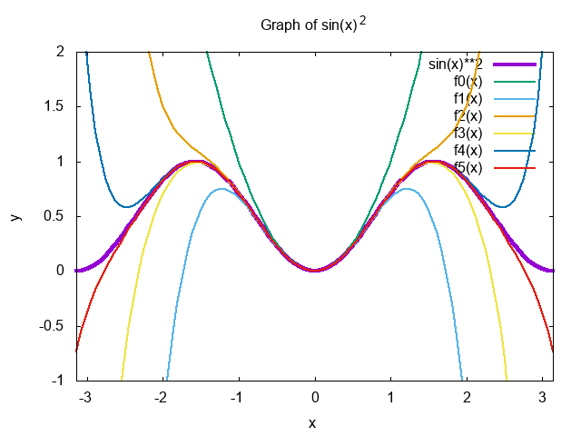

# 1. laboratorijas darbs "Skaitliskās metodes"
## sin(x)*sin(x) funkcijas aprēķins, izmantojot Teilora rindu
Teilora rinda ir matemātiskā metode, kas ļauj tuvināti izteikt funkcijas ar polinomu t.s. veikt sarežģītu funkciju aproksimāciju. Šī metode ir nosaukta angļu matemātiķa Brouka Teilora vārdā. Teilora rindu var izmantot, lai aprakstītu jebkuru funkciju ƒ(x), kas ir bezgalīgi diferencējama. Funkcija _ƒ_ var būt reāla vai kompleksa. Tad Teilora rindu izmanto, lai aprakstītu, kā šī funkcija izskatās kāda skaitļa _a_ apkārtnē. Laboratorijas darba laikā tika izstrādāta C programma, kur funkcija `sin²(x)` tika izteikta, izmantojot Teilora rindu.

Attēlā ir parādīts funkcijas `sin²(x)` grafiks, kas attēlots kopā ar tās Teilora rindu aproksimācijām dažādās kārtās. Šeit funkcija `sin²(x)` ir zīmēta kā bieza līnija (violeta), bet Teilora rindas aproksimācijas - kā plānākas līnijas. Teilora rindas ir attēlotas līdz 6. kārtai (f0 līdz f5), kur katrs nākamais polinoms ietver augstākus pakāpes locekļus, lai labāk tuvinātu sākotnējo funkciju. Grafiks sniedz vizuālu ieskatu, kā Teilora rindas polinomi pakāpeniski tuvojas sākotnējās funkcijas (šajā gadījumā `sin²(x)`) formai, īpaši tuvāk x ass centram, kur x ir intervālā `[-π,π]`. Tas parāda, kā katrā nākamajā kārtā polinoms kļūst precīzāks, labāk aproksimējot mērķa funkciju.
