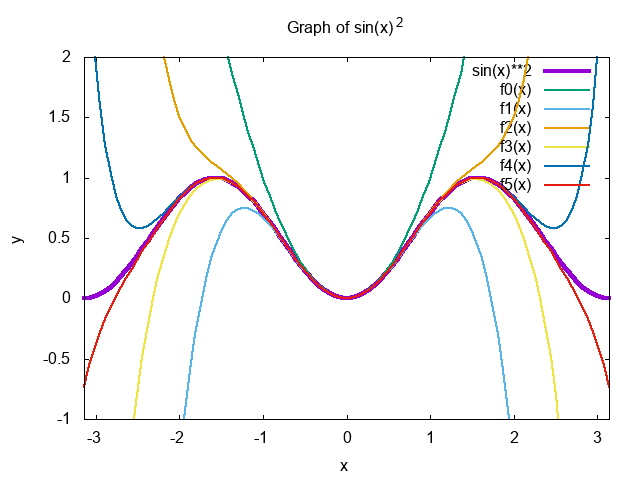
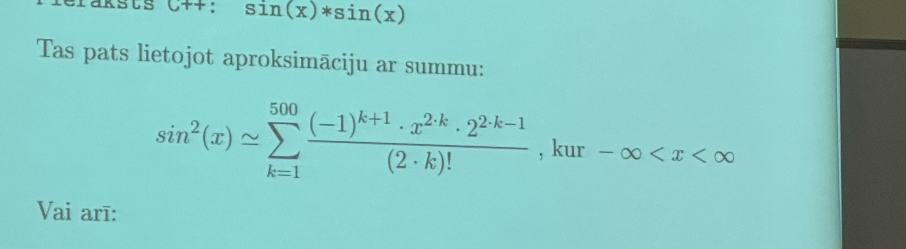

# 1. laboratorijas darbs "Skaitliskās metodes"
## sin(x)*sin(x) funkcijas aprēķins, izmantojot Teilora rindu

Teilora rinda ir matemātiskā metode, kas ļauj tuvināti izteikt funkcijas ar polinomu t.s. veikt sarežģītu funkciju aproksimāciju. Šī metode ir nosaukta angļu matemātiķa Brouka Teilora vārdā. Teilora rindu var izmantot, lai aprakstītu jebkuru funkciju ƒ(x), kas ir bezgalīgi diferencējama. Funkcija _ƒ_ var būt reāla vai kompleksa. Tad Teilora rindu izmanto, lai aprakstītu, kā šī funkcija izskatās kāda skaitļa _a_ apkārtnē. Laboratorijas darba laikā tika izstrādāta funkcijas `sin²(x)` aproksimācija C programmēšanas valodā, izmantojot Teilora rindas.



Attēlā ir parādīts funkcijas `sin²(x)` grafiks, kas attēlots kopā ar tās Teilora rindu aproksimācijām dažādās kārtās. Šeit funkcija `sin²(x)` ir zīmēta kā bieza līnija (violeta), bet Teilora rindas aproksimācijas - kā plānākas līnijas. Teilora rindas ir attēlotas līdz 6. kārtai (_f0_ līdz _f5_), kur katrs nākamais polinoms ietver augstākus pakāpes locekļus, lai labāk tuvinātu sākotnējo funkciju. Grafiks sniedz vizuālu ieskatu, kā Teilora rindas polinomi pakāpeniski tuvojas sākotnējās funkcijas (šajā gadījumā `sin²(x)`) formai, īpaši tuvāk x ass centram, kur x ir intervālā `[-π,π]`. Tas parāda, kā katrā nākamajā kārtā polinoms kļūst precīzāks, labāk aproksimējot mērķa funkciju.

## sin²(x) aproksimācija ar summu

Sākumā tika dota funkcijas `sin²(x)` aproksimācija ar summu:


## Programmas koda analīze

**Funkcija `lietotaja_sinuss_kvadrats(long double x)`:**

- Šī funkcija aprēķina sinusa funkcijas kvadrātu, izmantojot summas izteiksmi.
- Sākumā tiek aprēķināts pirmais loceklis `a` no summas, kas ir atkarīgs no argumenta `x`.
- Tad ciklā tiek aprēķināti nākamie summas locekļi līdz 500 locekļiem, izmantojot rekurences attiecību.
- Katrā iterācijā tiek izdrukāta summas locekļa un daļējās summas vērtība.
- Beigās funkcija atgriež galīgo summu, kas ir sinusa kvadrāta tuvinājums.

**Galvenā funkcija `main()`:**

- Šajā funkcijā lietotājs tiek lūgts ievadīt argumentu x, kur -∞ < x < ∞ .
- Tad tiek aprēķināta un izdrukāta standarta sin(x)*sin(x) vērtība, izmantojot standarta sin funkciju.
- Tālāk tiek izsaukta lietotaja_sinuss_kvadrats funkcija, lai aprēķinātu sinusa kvadrātu, izmantojot summas izteiksmi, un tiek izdrukāts rezultāts.
- Beigās tiek izdrukāta informācija par summas izteiksmi un rekurences reizinātāju.

## Programmas darbības apraksts

Saglabājiet kodu .c failā, piemēram, 1ld_series.c.
Atveriet termināli vai komandrindu un ejiet uz direktoriju, kur atrodas fails.
Kompilējiet programmu, izmantojot GCC vai citu C kompilatoru. Piemēram:


Nokompilēt failu `1ld_series.c`, var ar šādu komandu:
```shell
$ gcc 1ld_series.c -o sinkvadrats.out -lm
```
- Šeit `-lm` ir nepieciešams, lai saistītu matemātikas bibliotēku `(math.h)`.
- `gcc`: Tas ir GNU Compiler Collection, populārs kompilators C un citām programmēšanas valodām.
- `1ld_series.c`: Tas ir jūsu C programmas avota koda fails.
- `-o sinkvadrats.out`: Šis parametrs norāda, ka izvades (kompilētā) faila nosaukums būs `sinkvadrats.out`. Ja `-o` nav norādīts, pēc noklusējuma nosaukums būs `a.out` Linux un Unix sistēmās.

Palaist izpildāmo failu, var termināli ievadot:
```shell
$ ./sinkvadrats.out
```
Lietotājam tiks prasīts ievadīt argumentu `x`. Pēc tam, kad lietotājs ievadīja skaitli un nospieda `Enter`, tiek aprēķināta un izvadīta `sin²(x)` vērtība izmantojot Linux operētājsistēmas `sin²(x)` funkcijas realizāciju. Tālāk tiek veikts funkcijas vērtības aprēķins, izmantojot paša izstrādātu `sin²(x)` realizāciju. Programmas darbības piemērs aprēķinot `sin²(2.05)`:

Izvade terminālī:
```shell
Sin * sin aprekinasana: 
Ievadi argumentu x: 
2.05
Standarta funkcija: y=sin(2.05)*sin(2.05)=0.787411973266634590551404926373
x=2.05  a1  =4.202499999999999999878569356682           S1=4.202499999999999999878569356682
x=2.05  a499=4.489317039333868658805386184188e-1951     S499=0.787411973266634455459814234679
x=2.05  a500=-7.554096039159392608188605242558e-1956    S500=0.787411973266634455459814234679
y=sinuss(2.05)*sinuss(2.05) ar summu=0.787411973266634479529102463857
                 500                               
                ------                             
                \             k+1   2*k   2*k-1   
   2             \        (-1)  *  x  *  2        
sin(2.05) = 0.79 = >  -------------------------- 
                  /              (2 * k)!          
                 /                                 
                ------                             
                 k = 1                             
                               2    2       
                            (-2) * x        
rekurences reizinatajs: ------------------- 
                          k * (2 * k - 1)   
```
