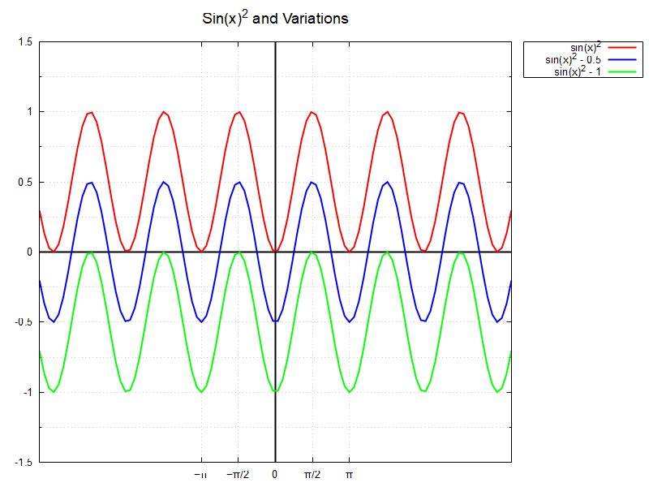

# 2. laboratorijas darbs "Skaitliskās metodes"
## Dihotomijas metode sakņu atrašanai

Dihotomijas metode, kas pazīstama arī kā intervālu dalīšanas metode, ir vienkārša, bet efektīva skaitliskā metode sakņu atrašanai. Tās būtība ir intervāla robežas, kurā atrodas sakne, pakāpeniskā sašaurināšana. Tas tiek realizēts, dalot intervālu uz pusēm un izvēloties to pusintervālu, kurā sakne atrodas (skatīt Attēls_1). Procesu atkārto tik ilgi, līdz tiek sasniegta vēlamā precizitāte. Laboratorijas darba laikā tika izstrādāta C programma, kas implementē dihotomijas metodi.


Attēlā redzama funkcijas grafika ilustrācija ar atzīmētām intervāla dalīšanas vietām, kas norāda uz dihotomijas metodes soļiem sakņu atrašanai.

## Dihotomijas metodes piemērošana

Sākumā tika izstrādāts algoritms, kas ļauj veikt funkcijas `f(x)` sakņu atrašanu, izmantojot dihotomijas metodi:


## Programmas koda analīze

**Funkcija `dihotomy(double a, double b, double tolerance)`:**

- Šī funkcija implementē dihotomijas metodi sakņu atrašanai.
- Argumenti `a` un `b` norāda intervāla sākumu un beigas, kurā tiek meklēta sakne, `tolerance` norāda uz precizitāti.
- Funkcija aprēķina funkcijas vērtību intervāla viduspunktā un pārbauda zīmes maiņu.
- Ja zīmes maiņa ir konstatēta, funkcija turpina saknes meklējumus jaunajā intervālā.
- Process tiek atkārtots līdz brīdim, kad intervāla garums ir mazāks par `tolerance`.
- Beigās funkcija atgriež saknes aptuveno vērtību.

# 2. laboratorijas darbs "Skaitliskās metodes"
## Grafiskā metode funkcijas sakņu atrašanai

Grafiskā metode ir vienkārša un vizuāla skaitliskā metode, kas ļauj tuvināti noteikt funkcijas saknes. Šī metode ir īpaši noderīga, lai vizuāli identificētu funkcijas krustpunktu ar x asi, kas atbilst funkcijas saknei. Grafiskā metode ļauj vizuāli novērtēt funkcijas sakņu atrašanās vietas intervālā. Laboratorijas darba laikā tika izstrādāta C programma, kas ļauj uzzīmēt funkcijas grafiku un vizuāli identificēt iespējamās saknes.



Attēlā ir parādīts funkcijas grafiks, kas uzzīmēts, izmantojot gnuplot. Grafiks ļauj vizuāli identificēt punktus, kur funkcijas grafiks šķērso x asi, kas norāda uz iespējamām saknēm. Šī metode ir noderīga, lai iegūtu sākotnējo tuvinājumu saknei, kas pēc tam var tikt precizēts, izmantojot citas skaitliskās metodes.

## Grafiskās metodes piemērošana

Sākumā tika izmantots gnuplot, lai uzzīmētu funkcijas `f(x)` grafiku:


## Programmas koda analīze

**Funkcija `find_root_graphically()`:**

- Šī funkcija palīdz identificēt funkcijas saknes grafiski.
- Sākumā tiek ģenerēti dati funkcijas grafika uzzīmēšanai.
- Tad tiek izmantots gnuplot, lai vizuāli parādītu funkcijas grafiku un iespējamās saknes.
- Katrā iterācijā tiek parādīts funkcijas grafiks ar aizvien precīzākiem intervāliem.
- Beigās funkcija sniedz vizuālu informāciju par iespējamām saknēm.

**Galvenā funkcija `main()`:**

- Šajā funkcijā lietotājs tiek lūgts ievadīt funkcijas izteiksmi un intervālu, kurā meklēt saknes.
- Tiek ģenerēti dati funkcijas grafika uzzīmēšanai.
- Tālāk tiek izsaukta funkcija `find_root_graphically()`, lai vizuāli identificētu iespējamās saknes.
- Beigās tiek parādīts funkcijas grafiks ar atzīmētām iespējamām saknēm.

## Programmas darbības apraksts

Saglabājiet kodu .c failā, piemēram, `2ld_roots.c`.
Atveriet termināli vai komandrindu un ejiet uz direktoriju, kur atrodas fails.
Kompilējiet programmu, izmantojot GCC vai citu C kompilatoru. Piemēram:

```shell
$ gcc 2ld_roots.c -o roots_finder.out -lm
