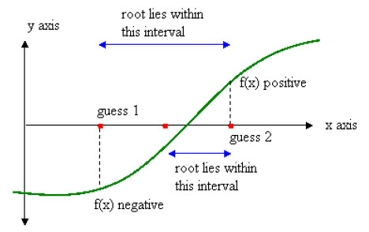

# 2. laboratorijas darbs "Skaitliskās metodes"
## Dihotomijas metode sakņu atrašanai

Dihotomijas metode, kas pazīstama arī kā intervālu dalīšanas metode, ir vienkārša, bet efektīva skaitliskā metode sakņu atrašanai. Tās būtība ir intervāla robežas, kurā atrodas sakne, pakāpeniskā sašaurināšana. Tas tiek realizēts, dalot intervālu uz pusēm un izvēloties to pusintervālu, kurā sakne atrodas (skatīt *Attēls 1*). Procesu atkārto tik ilgi, līdz tiek sasniegta vēlamā precizitāte. Laboratorijas darba laikā tika izstrādāta C programma, kas implementē dihotomijas metodi.



*Attēls 1: Dihotomijas metodes ilustrācija.*

Avots: [ResearchGate]([https://www.example.com](https://www.researchgate.net/figure/Bisection-method-This-Bisection-method-states-that-if-fx-is-continuous-which-is-defined_fig2_336638530))


Attēlā redzama funkcijas grafika ilustrācija ar atzīmētām intervāla dalīšanas vietām, kas norāda uz dihotomijas metodes soļiem sakņu atrašanai.

## Funkcijas sin(x)^2 un tās variācijas

Laboratorijas darba ietvaros tika analizēta funkcija `sin(x)^2` un tās variācijas. Ar gnuplot tika vizuāli attēlotas `sin(x)^2`, `sin(x)^2 - 0.5` un `sin(x)^2 - 1` funkcijas, kur nobīdes _A_ vertība ir _A=0; A=0.5; A=1_, kā piemērus, lai grafiski parādītu, kur grafiki krusto _x asi_ - saknes.


*Attēls 2: Funkcijas `sin(x)^2` un tās variācijas.*

## Programmas rezultāts
Kā var redzēt *Attēls 2* funkcijai `sin(x)^2` sakne intervālā [2;5] ir `x = π`, kas ir aptuveni `3.14159`. Izpilot kodu ar precizitāti `0.001` un iterāciju skaitu `1111`  tika iegūts, ka sakne `x = 3.110919475555419921875`, kas ir ļoti tuva vērtība `π`. Skatīt rezultātu zemāk:
```shell
sin(x)^2-A sakņu meklētājs (Dihotomijas metode)
---------------------------------------------------
Lūdzu ievadiet mazākās robežas 'a' vērtību: 2
Lūdzu ievadiet lielākās robežas 'b' vērtību: 5
Saknes meklēšanas intervāls [2.000;5.000]
---------------------------------------------------
Lūdzu ievadiet nobīdes A vērtību (funkcija tiks bīdīta uz leju vai augšu) A = 0
Lūdzu ievadiet precizitātes vērtību (piem. 0.001): 0.001
---------------------------------------------------
Sakne atrodas tuvu pie vērtībām: 
         x = 3.110919475555419921875000000000
         sin(3.1109)^2 - 0.00000 = 0.000940548838116228580474853516
Vajadzīgais iterāciju skaits pie precizitātes 0.001000 ir 1111
```
## Programmas koda analīze

**Galvenā funkcija `main()`:**

- Šajā funkcijā lietotājs tiek lūgts ievadīt funkcijas izteiksmi un intervālu, kurā meklēt saknes.
- Tiek ģenerēti dati funkcijas grafika uzzīmēšanai.
- Tālāk tiek izsaukta funkcija `find_root_graphically()`, lai vizuāli identificētu iespējamās saknes.
- Beigās tiek parādīts funkcijas grafiks ar atzīmētām iespējamām saknēm.

**Galvenā funkcija `main()`:**

- Šajā funkcijā lietotājs tiek lūgts ievadīt funkcijas izteiksmi un intervālu, kurā meklēt saknes.
- Tiek ģenerēti dati funkcijas grafika uzzīmēšanai.
- Tālāk tiek izsaukta funkcija `find_root_graphically()`, lai vizuāli identificētu iespējamās saknes.
- Beigās tiek parādīts funkcijas grafiks ar atzīmētām iespējamām saknēm.

## Programmas darbības apraksts

Saglabājiet kodu .c failā, piemēram, `2ld_roots.c`.
Atveriet termināli vai komandrindu un ejiet uz direktoriju, kur atrodas fails.
Kompilējiet programmu, izmantojot GCC vai citu C kompilatoru. Piemēram:

```shell
$ gcc 2ld_roots.c -o roots_finder.out -lm
```
