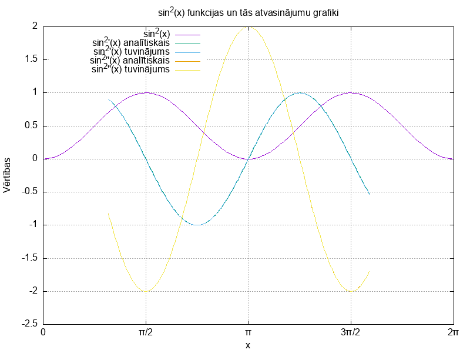

# 3. laboratorijas darbs "Skaitliskās metodes"
## Skaitliskā diferencēšana funkcijai sin(x)^2
Skaitliskā diferencēšana ir metode, ko izmanto, lai aptuveni aprēķinātu funkcijas atvasinājumu noteiktā punktā. Šī metode ir īpaši noderīga, ja atvasinājuma analītiskā forma ir sarežģīta vai nezināma. Skaitliskā diferencēšana aptuveni aprēķina atvasinājumu, izmantojot funkcijas vērtības noteiktos punktos. Laboratorijas darbā tiek apskatīta funkcijas `sin(x)^2` skaitliskā diferencēšana, izmantojot C programmēšanas valodu. Kods sastāv no funkcijām, lai aprēķinātu sin(x)^2 un tās pirmās un otrās kārtas atvasinājumus, analītiski un skaitliski diferencējot.



Palaižot `derivative.gp` (izmantojot `gnuplot`) - tika attēlots `sin(x)^2` grafiks un `sin(x)^2` pirmās un otrās kārtas gan analītisku, gan skaitliski diferencētu atvasinājumu grafiki. Attēlā redzamie grafiki ir diapazonā [1:5] ar soli 0.01. Grafiki ir izveidoti no `derivative.dat` faila datiem, kuri tika ierakstīti, izpildot programmu. Attēlā pirmās un otrās kārtas analītiskie un skaitliski diferencētie atvasinājumi izskatās kā viens grafiks, jo tie atšķiras ar ļoti mazu vērtību.

## Programmas koda struktūra
**1. Funkcijas definīcijas:**
- `sin_kvadrats(float x)`: Aprēķina sin^2(x).
- `pirmais_analit(float x)`: Aprēķina sin^2(x) pirmo analītisko atvasinājumu.
- `otrais_analit(float x)`: Aprēķina sin^2(x) otro analītisko atvasinājumu.

**2. Atvasinājumu aproksimācijas:**
- `pirmais_parnest(float x, float delta_x)`: Aprēķina sin^2(x) pirmās kārtas atvasinājumu izmantojot skaitlisko diferencēšanu.
- `otrais_parnest(float x, float delta_x)`: Aprēķina sin^2(x) otrās kārtas atvasinājumu izmantojot skaitlisko diferencēšanu.

**3. Galvenā funkcija `(main)`:**
- Nolasa ievades vērtības.
- Veic aprēķinus intervālā no `a` līdz `b` ar precizitāti `delta_x`.
- Rezultātus izvada gan konsolē, gan ieraksta failā `derivative.dat`.

## Programmas koda analīze

**Programmas darbība:**

1. Lietotājam jāievada sākuma un beigu vērtības `(a un b)`, kā arī diferencēšanas solis `(delta_x)`
2. Pēc šo vērtību ievades, programma aprēķina un izvada:
- `sin(x)^2` vērtības;
- `sin(x)^2` **pirmo** un **otro atvasinājumu** gan analītiski, gan izmantojot skaitlisko diferencēšanu (intervālā no `a` līdz `b`).
- Rezultāti tiek ierakstīti failā `derivative.dat`, kurā tiek saglabāti gan analītiskie, gan skaitliskie atvasinājumi noteiktam `x` vērtību diapazonam.
  
## Atvasinājumu vērtības aprēķināšana

**Pirmās kārtas atvasinājums:**

1. _Analītiskā metode_ `(pirmais_analit funkcija)`: pirmās kārtas atvasinājums tiek aprēķināts izmantojot matemātisko analīzi. Šajā gadījumā, `sin(x)^2` pirmā kārtas atvasinājums ir `2sin(x)cos(x)`.
2. _Skaitliskā metode_ `(pirmais_parnest funkcija)`: pirmās kārtas atvasinājums tiek aprēķināts izmantojot skaitlisko diferencēšanu ar tiešās atšķirības metodi. Šeit izmanto izteiksmi `(sin(x + delta_x)^2 - sin(x)^2) / delta_x`,
kur:

- `(sin(x + delta_x)^2` - Tā ir `sin(x)^2` vertība pie `x + delta_x`, kur `delta_x` ir maza pieauguma vērtība, kas tiek pievienota `x`.
- `sin(x)^2` - Tā ir `sin(x)` vertība pie `x`.
- `(sin(x + delta_x)^2 - sin(x)^2)` - Šī izteiksme aprēķina funkcijas izmaiņu starp šiem diviem punktiem.
- `delta_x` - Dalot šo izmaiņu ar `delta_x` jeb soli, iegūst vidējo izmaiņas ātrumu šajā intervālā.

Kad `delta_x` tuvojas nullei, šī formula tuvojas pirmā kārtas atvasinājumam `sin(x)^2`. Tomēr skaitliskajā diferencēšanā izmanto nelielu, bet fiksētu `delta_x` vērtību.

Šī metode ir noderīga, ja funkcija ir sarežģīta vai nav iespējams atrast analītisko atvasinājumu.

**Otrās kārtas atvasinājums:**

1. _Analītiskā metode_ `(otrais_analit funkcija)`: otrās kārtas atvasinājums tiek aprēķināts, veicot pirmās kārtas atvasinājuma atkārtotu atvasināšanu. `sin^2(x)` otrās kārtas atvasinājums ir `2cos^2(x) - 2sin^2(x)`.
2. _Skaitliskā metode_ `(otrais_parnest funkcija)`: Līdzīgi pirmajam gadījumam, otrās kārtas atvasinājums tiek aprēķināts izmantojot skaitlisko diferencēšanu: `(sin(x + delta_x)^2 - 2sin(x)^2 + sin(x - delta_x)^2) / delta_x^2`,
kur:

- `sin(x + delta_x)^2` un `sin(x - delta_x)^2` - Tās ir `sin(x)^2` vērtības pie x + delta_x un x - delta_x.
Šeit `delta_x` ir maza vērtība, kas tiek pievienota un atņemta no `x`.
- `2sin(x)^2`: Divreizēja `sin^2(x)` vērtība pašreizējā punktā `x`.
- `(sin(x + delta_x)^2 - 2sin(x)^2 + sin(x - delta_x)^2)`: Šī izteiksme aprēķina funkcijas izmaiņu šajā intervālā.
- `delta_x^2`: Dalot šo izmaiņu ar kvadrātu δx, iegūst vidējo izmaiņas ātrumu attiecībā pret `x` izmaiņu kvadrātu.

Arī šajā gadījumā mazākas `delta_x` vērtības nodrošina precīzākus rezultātus, bet praksē tiek izmantotas fiksētas vērtības.

## Programmas palaišanas apraksts

Saglabājiet kodu .c failā, piemēram, kā ir dots `3ld_derivative.c`.
Atveriet termināli un ejiet uz direktoriju, kur atrodas fails.

Kompilējiet programmu, izmantojot GCC vai citu C kompilatoru, ar šādu komandu:
```shell
$ gcc 3ld_roots.c -o derivative.out -lm
```
Lai palaistu failu:
```shell
$ ./derivative.out
```

## Programmas rezultāts

Lietotājs ievadīja `a` vērtību vienādu ar `1`, `b` vērtību vienādu ar `5` un precizitāti `delta_x` vienādu ar `0.01`. Dotie dati tika ierakstīti `derivative.dat`. Rezultāts terminālī (attēlotas tikai pirmas 3 un pēdējas 3 vērtības):
```shell
Ievadi a vērtību: 1
Ievadi b vērtību: 5
Ievadi precizitāti (delta_x): 0.01
1.000000        0.708073        0.909297        0.905073        -0.832294       -0.832677
1.010000        0.717124        0.900793        0.896388        -0.868497       -0.868440
1.020000        0.726088        0.891929        0.887346        -0.904352       -0.904203
...
...
...
4.970019        0.935082        -0.492762       -0.501442       -1.740329       -1.740456
4.980020        0.930068        -0.510066       -0.518644       -1.720271       -1.720190
4.990020        0.924881        -0.527166       -0.535643       -1.699525       -1.699925
```

Dotie dati `derivative.dat` (attēlotas tikai pirmas 3 un pēdējas 3 vērtības):
```shell
x		sin^2(x)	sin^2'(x) a.	sin^2'(x) par.	sin^2''(x) a.	sin^2''(x) par.
1.000000	0.708073	0.909297		0.905073		-0.832294		-0.832677
1.010000	0.717124	0.900793		0.896388		-0.868497		-0.868440
1.020000	0.726088	0.891929		0.887346		-0.904352		-0.904203
...
...
...
4.970019	0.935082	-0.492762		-0.501442		-1.740329		-1.740456
4.980020	0.930068	-0.510066		-0.518644		-1.720271		-1.720190
4.990020	0.924881	-0.527166		-0.535643		-1.699525		-1.699925
```
## Secinājumi

1. Analītiska atvasināšana sniedz precīzu atvasinājuma vērtību, jo tā balstās uz matemātiskajām funkciju īpašībām. Savukārt, skaitliskā diferencēšana aptuveni aprēķina atvasinājumu, izmantojot funkcijas vērtības noteiktos punktos. Rezultāti parāda, ka skaitliski aprēķinātie atvasinājumi var atšķirties no analītiskajiem, īpaši pie lielākām `delta_x` vērtībām.
2. Mazas `delta_x` vērtības uzlabo skaitliskās diferencēšanas precizitāti, tuvinot tās rezultātus analītiskajiem. Tomēr, pārāk mazas `delta_x` vērtības var radīt skaitļošanas kļūdas noapaļošanas problēmas dēļ.
3. Skaitliskā diferencēšana ir īpaši svarīga praksē, kad funkcijas analītiskais atvasinājums nav zināms vai ir grūti aprēķināms. Šādos gadījumos skaitliskā diferencēšana nodrošina efektīvu un praktisku risinājumu, sin(x)^2 funkcijas gadījumā, analītiskie atvasinājumi ir salīdzinoši vienkārši aprēķināmi. Taču sarežģītākām funkcijām skaitliskā diferencēšana varētu būt vienīgā metode.
4. Rezultāti atspoguļo, ka metodes izvēle - analītiskā vai skaitliskā - ir atkarīga no konkrētās problēmas un pieejamās informācijas par funkciju.
