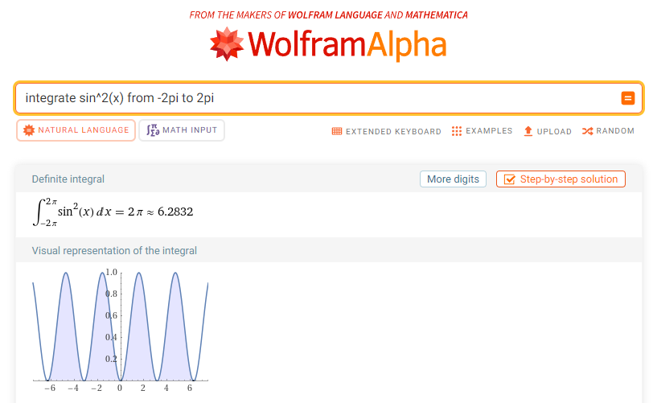

# 4. laboratorijas darbs "Skaitliskās metodes"
## Skaitliskā integrēšana funkcijai sin(x)^2

Skaitliskā integrēšana ļauj aprēķināt noteiktu integrāļu tuvinājumus, izmantojot datoralgoritmus. Tā ir īpaši svarīga situācijās, kurās analītiska integrāļa vērtības noteikšana ir sarežģīta vai neiespējama. Laboratorijas darbā es izmantošu trīs skaitliskās integrēšanas metodes: `taisnstūra metodi`, `trapeces metodi` un `Simpsona metodi` un izmantojot C programmēšanas valodu skaitliski integrēšu funckciju `sin(x)^2`.

## Taisnstūra metode

`Taisnstūra metode` integrāļa aprēķinam balstās uz funkcijas vērtības aptuvenu aizstāšanu ar taisnstūra laukumu, kas veidojas intervāla sadalījumā.

## Trapeces metode

`Trapeces metode` izmanto trapeces laukuma aprēķinu, lai iegūtu integrāļa tuvinājumu, izmantojot funkcijas vērtības intervāla galapunktos un starppunktos.

## Simpsona metode

`Simpsona metode` ir precīzāka, izmantojot parabolu, kas aptuveni atbilst funkcijas grafikam intervālā, tādējādi nodrošinot augstāku aprēķina precizitāti.

## Taisnstūra metode `sin(x)^2`

```shell
// Taisnstūra metode 
double taisnstura_metode(double a, double b, int n) {
    double h = (b - a) / n; // Aprēķina soli (h), kas ir intervāla [a, b] dalījums ar dalījumu skaitu (n)
    double laukums = 0.0; // Sākotnējā laukuma vērtība
    for (int i = 0; i < n; i++) {
        laukums += f(a + i * h + h / 2); // Pievieno laukumam funkcijas vērtību katrā taisnstūrī, kas aprēķināta tā vidū
    }
    return laukums * h; // Rezultāts tiek iegūts, reizinot summēto laukumu ar soli (h)
}
```
Taisnstūra metode ir viena no vienkāršākajām skaitliskās integrēšanas metodēm, kuras mērķis ir aprēķināt noteikta integrāļa tuvinājumu. Metodes darbība ir šāda:

1. **Intervāla sadalīšana**: 
   Intervāls `[a, b]`, kurā tiek aprēķināts integrālis, tiek sadalīts `n` vienādos apakšintervālos. Apakšintervālu platums `h` aprēķināts kā `(b-a)/n`. Tas nosaka, cik "plati" būs taisnstūri.

2. **Laukuma aprēķināšana**: 
   Katrā apakšintervālā tiek aprēķināta funkcijas `f(x)` vērtība tā vidū - `a + i * h + h/2`, kur `i` ir apakšintervāla indekss (no 0 līdz `n-1`). Šīs vērtības tiek uzskatītas par taisnstūra augstumu.

3. **Summas aprēķināšana**: 
   Katra taisnstūra laukums tiek aprēķināts, reizinot augstumu ar platumu `h`. Visu šo taisnstūru laukumi tiek summēti, lai iegūtu kopējo aptuveno integrāļa vērtību.

4. **Gala rezultāts**: 
   Rezultāts `laukums * h` ir visu taisnstūru laukumu summa, kas ir integrāļa tuvinājums intervālā `[a, b]`.

Metodes vispārigais grafiskais attēlojums (tas nav tieši sin(x)^2 funkcijai):


*Attēls 1: Taisnstūra metode.*

Avots: [Emory Computer Science]([https://www.cs.emory.edu/~cheung/Courses/170/Syllabus/07/rectangle-method.html))

Šī metode ir efektīva vienkāršu funkciju integrēšanai un ir īpaši noderīga, ja `n` ir liels skaitlis, kas nodrošina lielāku precizitāti. Tomēr tās precizitāte var nebūt augsta sarežģītākām funkcijām vai mazākam `n`, jo funkcijas vērtības tiek ņemtas tikai vienā punktā katrā apakšintervālā.


## Trapeces metode `sin(x)^2`

```shell
// Trapeces metode 
double trapeces_metode(double a, double b, int n) {
    double h = (b - a) / n; // Aprēķina soli (h)
    double summa = (f(a) + f(b)) / 2.0; // Sākuma un beigu punktu vidējā vērtība ir pirmā un pēdējā trapeces augstums
    for (int i = 1; i < n; i++) {
        summa += f(a + i * h); // Summē funkcijas vērtības katrā starppunktu, kas ir trapeces augstumi
    }
    return summa * h; // Reizinot summu ar soli, iegūst tuvinājumu integrālim
}
```
Trapeces metode ir viena no skaitliskās integrēšanas metodēm, kas nodrošina precīzāku integrāļa tuvinājumu salīdzinājumā ar taisnstūra metodi. Metodes darbība ir šāda:

1. **Intervāla sadalīšana**: 
   Līdzīgi kā taisnstūra metodē, intervāls `[a, b]` tiek sadalīts `n` vienādos apakšintervālos, un katram apakšintervālam aprēķina platumu `h`, kas ir `(b-a)/n`.

2. **Sākuma un beigu punktu apstrāde**: 
   Aprēķina funkcijas `f(x)` vērtības intervāla sākumā un beigās - `f(a)` un `f(b)`. Šīs vērtības tiek summētas un dalītas ar 2. Šī summa ir pirmā un pēdējā trapeces augstumu vidējā vērtība.

3. **Starppunktu apstrāde un summas aprēķināšana**: 
   Veic funkcijas `f(x)` vērtību summēšanu katrā apakšintervāla starppunktā `a + i * h` (kur `i` ir no 1 līdz `n-1`). Šīs vērtības atbilst trapeces augstumiem starp sākuma un beigu punktiem.

4. **Gala rezultāts**: 
   Reizinot iegūto summu ar platuma vērtību `h`, iegūst tuvinājumu integrālim intervālā `[a, b]`.

Metodes vispārigais grafiskais attēlojums (tas nav tieši sin(x)^2 funkcijai):


*Attēls 2: Trapeces metode.*

Avots: [bragitoff.com]([https://www.bragitoff.com/2017/08/trapezoidal-rule-c-program/))

Trapeces metode ir efektīvāka nekā taisnstūra metode, jo tā labāk aptver funkcijas izmaiņas visā intervālā. Tās precizitāte ir augstāka, it īpaši, ja intervālu skaits `n` ir liels.


## Simpsona metode `sin(x)^2`
```shell
// Simpsona metode
double simpsona_metode(double a, double b, int n) {
    double h = (b - a) / n;
    double summa = f(a) + f(b); // Sākuma un beigu punktu summa
    for (int i = 1; i < n; i++) {
        double x = a + i * h; // Aprēķina katru x vērtību intervālā
        summa += (i % 2 == 0 ? 2 : 4) * f(x); // Pāra i vērtībām pievieno 2*f(x), nepāra - 4*f(x) (Simpsona metodes specifika)
    }
    return summa * h / 3; // Gala rezultāts iegūts, reizinot summu ar h/3
}
```
Simpsona metode ir viena no precīzākajām skaitliskās integrēšanas metodēm, kas balstās uz intervāla sadalīšanu parabolu segmentos. Metodes darbība ir šāda:

1. **Intervāla sadalīšana**: 
   Tāpat kā iepriekšējās metodēs, intervāls `[a, b]` tiek sadalīts `n` vienādos apakšintervālos, un katram apakšintervālam aprēķina platumu `h`, kas ir `(b-a)/n`.

2. **Sākuma un beigu punktu apstrāde**: 
   Aprēķina funkcijas `f(x)` vērtības intervāla sākumā un beigās - `f(a)` un `f(b)`, un pievieno tās summai.

3. **Starppunktu apstrāde un summas aprēķināšana**: 
   Veic funkcijas `f(x)` vērtību summēšanu katrā apakšintervāla punktā `a + i * h`, kur `i` ir no 1 līdz `n-1`. Šī metode izmanto specifisku koeficientu pielietošanu: ja `i` ir pāra skaitlis, tiek izmantots koeficients 2; ja `i` ir nepāra skaitlis, tiek izmantots koeficients 4. Šī pieeja nodrošina lielāku precizitāti, jo labāk aproksimē funkcijas izmaiņas intervālā.

4. **Gala rezultāts**: 
   Reizinot iegūto summu ar `h/3`, iegūst tuvinājumu integrālim intervālā `[a, b]`.

Metodes vispārigais grafiskais attēlojums (tas nav tieši sin(x)^2 funkcijai):


*Attēls 2: Simpsona metode.*

Avots: [CUEMATH]([https://www.cuemath.com/simpsons-rule-formula/))

Simpsona metode ir efektīva kompleksāku funkciju integrēšanai, nodrošinot augstu precizitāti pat salīdzinoši mazā intervālu skaita gadījumā. Tas padara to par vienu no visprecīzākajām skaitliskās integrēšanas metodēm.

## Koda rezultāts:

Tika ievadīta `a` vērtība, kas aptuveni `-2π` un `b` - `2π`, precizitāte - `6`, tika iegūti rezultāti:
```shell
Ievadiet integrācijas apakšējo robežu [a-b] (a): -6.28
Ievadiet integrācijas augšējo robežu [a-b] (b): 6.28 
Ievadiet dalījumu skaitu (precizitāte): 6
Taisnstūra metode: 6.287695
Trapeces metode: 6.276160
Simpsona metode: 6.272301
```
Ekrānšāviņš no wolframalpha.com. Var redzēt, ka atbildet ir ļoti tuvu patiesajai vērtībai.

