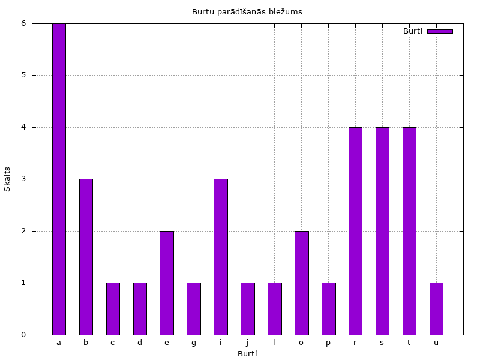

# 5. laboratorijas darbs "Skaitliskās metodes"
## Skaitļu kopas kārtošana un statistika
Laboratorijas darbā tika sakārtota simbolu rinda alfabēta secībā *(saskaņā ar ASCII skaitļiem)* izmantojot `Brubuļa kārtošanas metodi`, atrasta lielākā, mazākā vērtība, vidējā vērtība, mediāna un moda.

## ASCII

`ASCII`, kas pilnā nosaukumā (American Standard Code for Information Interchange) ir rakstzīmju kodēšanas standarts datoros. ASCII kodē 128 angļu valodas rakstzīmes kā skaitliskas vērtības. Šis standarts ietver burtus (gan lielos, gan mazos), ciparus, interpunkcijas zīmes un simbolus kā `Escape key (ESC)`, kur ASCII vērtība ir `27`. Tas izmanto 7 bitus, lai attēlotu katru rakstzīmi, jo baita pirmais bits vienmēr ir 0. Piemēram, lielo "T" apzīmē ar 84 vai 01010100 binārajā formā. Mazo burtu "t" binārā veidā apzīmē ar 116 vai 01110100.

Informācija ņemta no avotiem: https://www.britannica.com/topic/ASCII un https://techterms.com/definition/ascii

## Burbuļa metode

`Burbuļa metode (Bubble Sort)` ir vienkāršs algoritms datu kārtošanai. Tas strādā, salīdzinot blakus esošus elementus masīvā un apmainot tos, ja tie ir nepareizā secībā. Šis process tiek atkārtots līdz brīdim, kad masīvs ir pilnībā sakārtots.

Algoritma darbība ir vienkārša:

Sākot no masīva sākuma, algoritms salīdzina pirmo un otro elementu, tad otro un trešo, un tā tālāk līdz masīva beigām.
Ja kāds elements ir lielāks par nākamo (vai mazāks, atkarībā no kārtošanas virziena), tie tiek apmainīti vietām.
Šī procesa beigās lielākais elements (vai mazākais) būs nonācis masīva beigās.
Process tiek atkārtots masīvam, kas ir par vienu elementu īsāks, jo pēdējais elements jau ir pareizajā vietā.
Tas tiek turpināts, līdz viss masīvs ir sakārtots.
Izmantotais avots: https://www.productplan.com/glossary/bubble-sort/#:~:text=Bubble%20sort%20is%20a%20basic,they%20are%20out%20of%20order.

```shell
void bubble_sort(int ascii_vertibas[], char teksts[], int n) {
    int i, j, temp;
    char tempChar;
    for (i = 0; i < n-1; i++) {
        for (j = 0; j < n-i-1; j++) {
            if (ascii_vertibas[j] > ascii_vertibas[j+1]) {
                // Mainīt ASCII vērtības vietām
                temp = ascii_vertibas[j];
                ascii_vertibas[j] = ascii_vertibas[j+1];
                ascii_vertibas[j+1] = temp;

                // Mainīt atbilstošās rakstzīmes vietām
                tempChar = teksts[j];
                teksts[j] = teksts[j+1];
                teksts[j+1] = tempChar;
            }
        }
    }
}
```
BUBBLE SORT METODEI IZMANTOTIE AVOTI:
https://www.geeksforgeeks.org/bubble-sort-in-cpp/
https://www.softwaretestinghelp.com/bubble-sort/

## Programmas koda apraksts:

1. Lietotājs ievada tekstu, kas tiek saglabāts masīvā `teksts`. Tiek noņemts jaunas rindas rakstzīme no ievades gala.
2. Katras rakstzīmes ASCII vērtība tiek aprēķināta un saglabāta masīvā `ascii_vertibas`. Tas notiek, pārveidojot katru rakstzīmi uz tās ASCII vērtību.
3. Programma skaita katra alfabēta burtu izmantošanu tekstā, ignorējot lielos un mazos burtus.
4. Izmantojot `burbuļa metodi`, programma kārto rakstzīmes un to ASCII vērtības augošā secībā. Burbuļa metode salīdzina un apmaina blakus esošus elementus, līdz viss masīvs ir sakārtots.
5. Programma aprēķina un izvada dažādus statistikas datus, tostarp mazāko un lielāko ASCII vērtību, vidējo aritmētisko ASCII vērtību, mediānu un modu.
   Programma nosaka masīva modu un to, cik reizes tā sastopama, izmantojot funkciju `find_moda`.
6. Programma izvada burtu skaitu katram alfabēta burtam failā `burtu_skaits.dat`.

Programmas galvenā daļa nodrošina lietotāja ievades apstrādi, veic nepieciešamos aprēķinus un izvada rezultātus. Kodā izmantotās bibliotēkas `stdio.h`, `string.h`, `stdlib.h` un `ctype.h`, kas nodrošina nepieciešamās funkcijas teksta apstrādei, datu kārtošanai un faila operācijām.

## Rezultāts:
Nokompilējot 5ld_statistics.c un pēc tam palaižot failu:
```shell
Ievadiet tekstu: Ceturtais laboratorijas darbs pabeigts

Rakstzīmes un to ASCII vērtības:
C: 67
e: 101
t: 116
u: 117
r: 114
t: 116
a: 97
i: 105
s: 115
 : 32
l: 108
a: 97
b: 98
o: 111
r: 114
a: 97
t: 116
o: 111
r: 114
i: 105
j: 106
a: 97
s: 115
 : 32
d: 100
a: 97
r: 114
b: 98
s: 115
 : 32
p: 112
a: 97
b: 98
e: 101
i: 105
g: 103
t: 116
s: 115

Statistika:
Mazākā ASCII vērtība: 32
Lielākā ASCII vērtība: 117
Vidējā aritmētiskā ASCII vērtība: 100.11
Mediānas ASCII vērtība: 105.00
Modas ASCII vērtība: 97 (occurs 6 times)

Sakārtotas rakstzīmes un to ASCII vērtības:
 : 32
 : 32
 : 32
C: 67
a: 97
a: 97
a: 97
a: 97
a: 97
a: 97
b: 98
b: 98
b: 98
d: 100
e: 101
e: 101
g: 103
i: 105
i: 105
i: 105
j: 106
l: 108
o: 111
o: 111
p: 112
r: 114
r: 114
r: 114
r: 114
s: 115
s: 115
s: 115
s: 115
t: 116
t: 116
t: 116
t: 116
u: 117
```
**burtu_skaits_dat:**
```shell
a 6
b 3
c 1
d 1
e 2
g 1
i 3
j 1
l 1
o 2
p 1
r 4
s 4
t 4
u 1
```
**Palaižot gnuplot failu burtu_skaits.gp:**




